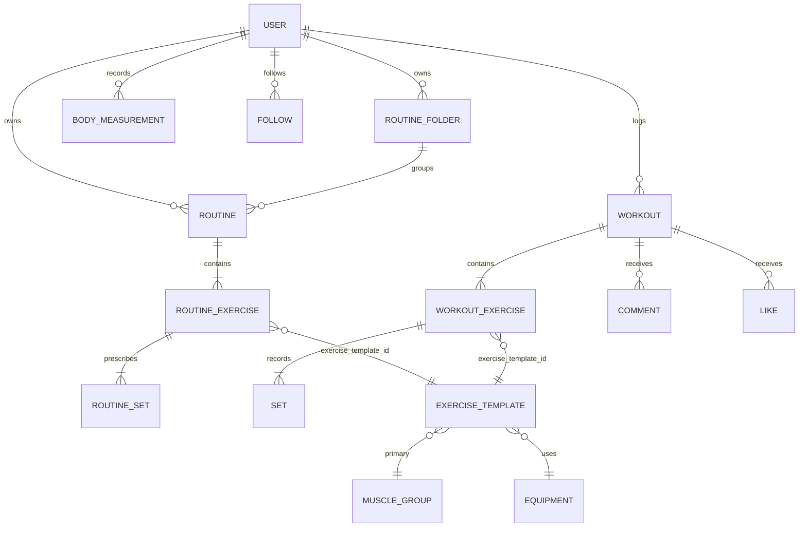

# 04 — Data model

**Sources.** Field-level truth comes from Hevy's own OpenAPI schemas [spec] and from live private
API payloads captured on an authenticated account [observed]. Where the two disagree both are shown
— the divergence is the lesson (§5).

## 1. Entity relationship model



**The join hub is `EXERCISE_TEMPLATE`.** Routines, workouts and every history/statistics query
reference it by `exercise_template_id`/`id`. Denormalizing that id onto each exercise row is what
makes "show me every set of Bench Press I have ever done" a single indexed query.

## 2. Relations in words

| Relation | Cardinality | Carrying field |
|---|---|---|
| User -> Routine | 1..* | folder membership via `folder_id` (null = default "My Routines") |
| RoutineFolder -> Routine | 1..* | `routine.folder_id` |
| Routine -> routine exercise | 1..* | array position / `index` |
| routine exercise -> ExerciseTemplate | *..1 | `exercise_template_id` |
| routine exercise -> set (prescription) | 1..* | nested `sets[]` |
| User -> Workout | 1..* | `workout.user_id` + `username` |
| Workout -> workout exercise | 1..* | `exercises[]`, each with `index`, `superset_id` |
| workout exercise -> ExerciseTemplate | *..1 | `exercise_template_id` |
| workout exercise -> Set (actual) | 1..* | `sets[]` with `index`, `completed_at` |
| User -> BodyMeasurement | 1..* | keyed by `date` |
| Workout -> Comment / Like | 1..* | `workout_comments/{id}`, `workout_likes/{id}` |
| User <-> User | *..* | `follow` / `unfollow`, `following_statuses` |
| ExerciseTemplate -> history | derived | `GET /v1/exercise_history/{exerciseTemplateId}` |

## 3. Public v1 API entities (spec-verbatim)

### Workout

| Field | Type | Required | Nullable | Enum / notes |
|---|---|---|---|---|
| `id` | `string` |  |  | The workout ID. |
| `title` | `string` |  |  | The workout title. |
| `routine_id` | `string` |  |  | The ID of the routine that this workout belongs to. |
| `description` | `string` |  |  | The workout description. |
| `start_time` | `string` |  |  | ISO 8601 timestamp of when the workout was recorded to have started. |
| `end_time` | `string` |  |  | ISO 8601 timestamp of when the workout was recorded to have ended. |
| `updated_at` | `string` |  |  | ISO 8601 timestamp of when the workout was last updated. |
| `created_at` | `string` |  |  | ISO 8601 timestamp of when the workout was created. |
| `exercises` | `array<object>` |  |  |  |

### Exercise

| Field | Type | Required | Nullable | Enum / notes |
|---|---|---|---|---|
| `index` | `number` |  |  | Index indicating the order of the exercise in the workout. |
| `title` | `string` |  |  | Title of the exercise |
| `notes` | `string` |  |  | Notes on the exercise |
| `exercise_template_id` | `string` |  |  | The id of the exercise template. This can be used to fetch the exercise template. |
| `superset_id` | `number` |  | yes | The id of the superset that the exercise belongs to. A value of null indicates the exercise is not part of a s |
| `sets` | `array<Set>` |  |  |  |

### Set

| Field | Type | Required | Nullable | Enum / notes |
|---|---|---|---|---|
| `index` | `number` |  |  | Index indicating the order of the set in the workout. |
| `type` | `string` |  |  | The type of set. This can be one of 'normal', 'warmup', 'dropset', 'failure' |
| `weight_kg` | `number` |  | yes | Weight lifted in kilograms. |
| `reps` | `number` |  | yes | Number of reps logged for the set |
| `distance_meters` | `number` |  | yes | Number of meters logged for the set |
| `duration_seconds` | `number` |  | yes | Number of seconds logged for the set |
| `rpe` | `number` |  | yes | RPE (Relative perceived exertion) value logged for the set |
| `custom_metric` | `number` |  | yes | Custom metric logged for the set (Currently only used to log floors or steps for stair machine exercises) |

### ExerciseTemplate

| Field | Type | Required | Nullable | Enum / notes |
|---|---|---|---|---|
| `id` | `string` |  |  | The exercise template ID. |
| `title` | `string` |  |  | The exercise title. |
| `type` | `string` |  |  | The exercise type. |
| `primary_muscle_group` | `string` |  |  | The primary muscle group of the exercise. |
| `secondary_muscle_groups` | `array<string>` |  |  | The secondary muscle groups of the exercise. |
| `equipment` | `$ref:EquipmentCategory` |  |  |  |
| `is_custom` | `boolean` |  |  | A boolean indicating whether the exercise is a custom exercise. |

### Routine

| Field | Type | Required | Nullable | Enum / notes |
|---|---|---|---|---|
| `id` | `string` |  |  | The routine ID. |
| `title` | `string` |  |  | The routine title. |
| `folder_id` | `number` |  | yes | The routine folder ID. |
| `updated_at` | `string` |  |  | ISO 8601 timestamp of when the routine was last updated. |
| `created_at` | `string` |  |  | ISO 8601 timestamp of when the routine was created. |
| `exercises` | `array<object>` |  |  |  |

### RoutineFolder

| Field | Type | Required | Nullable | Enum / notes |
|---|---|---|---|---|
| `id` | `number` |  |  | The routine folder ID. |
| `index` | `number` |  |  | The routine folder index. Describes the order of the folder in the list. |
| `title` | `string` |  |  | The routine folder title. |
| `updated_at` | `string` |  |  | ISO 8601 timestamp of when the folder was last updated. |
| `created_at` | `string` |  |  | ISO 8601 timestamp of when the folder was created. |

### PostRoutinesRequestExercise

| Field | Type | Required | Nullable | Enum / notes |
|---|---|---|---|---|
| `exercise_template_id` | `string` |  |  | The ID of the exercise template. |
| `superset_id` | `integer` |  | yes | The ID of the superset. |
| `rest_seconds` | `integer` |  | yes | The rest time in seconds. |
| `notes` | `string` |  | yes | Additional notes for the exercise. |
| `sets` | `array<PostRoutinesRequestSet>` |  |  |  |

### PostRoutinesRequestSet

| Field | Type | Required | Nullable | Enum / notes |
|---|---|---|---|---|
| `type` | `string` |  |  | `warmup`, `normal`, `failure`, `dropset` |
| `weight_kg` | `number` |  | yes | The weight in kilograms. |
| `reps` | `integer` |  | yes | The number of repetitions. |
| `distance_meters` | `integer` |  | yes | The distance in meters. |
| `duration_seconds` | `integer` |  | yes | The duration in seconds. |
| `custom_metric` | `number` |  | yes | A custom metric for the set. Currently used for steps and floors. |
| `rep_range` | `object` |  | yes | Range of reps for the set, if applicable |

### PostWorkoutsRequestExercise

| Field | Type | Required | Nullable | Enum / notes |
|---|---|---|---|---|
| `exercise_template_id` | `string` |  |  | The ID of the exercise template. |
| `superset_id` | `integer` |  | yes | The ID of the superset. |
| `notes` | `string` |  | yes | Additional notes for the exercise. |
| `sets` | `array<PostWorkoutsRequestSet>` |  |  |  |

### PostWorkoutsRequestSet

| Field | Type | Required | Nullable | Enum / notes |
|---|---|---|---|---|
| `type` | `string` |  |  | `warmup`, `normal`, `failure`, `dropset` |
| `weight_kg` | `number` |  | yes | The weight in kilograms. |
| `reps` | `integer` |  | yes | The number of repetitions. |
| `distance_meters` | `integer` |  | yes | The distance in meters. |
| `duration_seconds` | `integer` |  | yes | The duration in seconds. |
| `custom_metric` | `number` |  | yes | A custom metric for the set. Currently used for steps and floors. |
| `rpe` | `number` |  | yes | `6`, `7`, `7.5`, `8`, `8.5`, `9`, `9.5`, `10` |

### BodyMeasurement

| Field | Type | Required | Nullable | Enum / notes |
|---|---|---|---|---|
| `date` | `string` | yes |  |  |
| `weight_kg` | `number` |  | yes |  |
| `lean_mass_kg` | `number` |  | yes |  |
| `fat_percent` | `number` |  | yes |  |
| `neck_cm` | `number` |  | yes |  |
| `shoulder_cm` | `number` |  | yes |  |
| `chest_cm` | `number` |  | yes |  |
| `left_bicep_cm` | `number` |  | yes |  |
| `right_bicep_cm` | `number` |  | yes |  |
| `left_forearm_cm` | `number` |  | yes |  |
| `right_forearm_cm` | `number` |  | yes |  |
| `abdomen` | `number` |  | yes |  |
| `waist` | `number` |  | yes |  |
| `hips` | `number` |  | yes |  |
| `left_thigh` | `number` |  | yes |  |
| `right_thigh` | `number` |  | yes |  |
| `left_calf` | `number` |  | yes |  |
| `right_calf` | `number` |  | yes |  |

### ExerciseHistoryEntry

| Field | Type | Required | Nullable | Enum / notes |
|---|---|---|---|---|
| `workout_id` | `string` |  |  | The workout ID |
| `workout_title` | `string` |  |  | The workout title |
| `workout_start_time` | `string` |  |  | ISO 8601 timestamp of when the workout was recorded to have started. |
| `workout_end_time` | `string` |  |  | ISO 8601 timestamp of when the workout was recorded to have ended. |
| `exercise_template_id` | `string` |  |  | The exercise template ID |
| `weight_kg` | `number` |  | yes | The weight in kilograms |
| `reps` | `integer` |  | yes | The number of repetitions |
| `distance_meters` | `integer` |  | yes | The distance in meters |
| `duration_seconds` | `integer` |  | yes | The duration in seconds |
| `rpe` | `number` |  | yes | The Rating of Perceived Exertion |
| `custom_metric` | `number` |  | yes | A custom metric for the set |
| `set_type` | `string` |  |  | The type of set (warmup, normal, failure, dropset) |

### UserInfoResponse

| Field | Type | Required | Nullable | Enum / notes |
|---|---|---|---|---|
| `data` | `$ref:UserInfo` |  |  |  |

### PaginatedWorkoutEvents

| Field | Type | Required | Nullable | Enum / notes |
|---|---|---|---|---|
| `page` | `integer` | yes |  | The current page number |
| `page_count` | `integer` | yes |  | The total number of pages available |
| `events` | `array<?>` | yes |  | An array of workout events (either updated or deleted) |

### UpdatedWorkout

| Field | Type | Required | Nullable | Enum / notes |
|---|---|---|---|---|
| `type` | `string` | yes |  | Indicates the type of the event (updated) |
| `workout` | `$ref:Workout` | yes |  |  |

### DeletedWorkout

| Field | Type | Required | Nullable | Enum / notes |
|---|---|---|---|---|
| `type` | `string` | yes |  | Indicates the type of the event (deleted) |
| `id` | `string` | yes |  | The unique identifier of the deleted workout |
| `deleted_at` | `string` |  |  | A date string indicating when the workout was deleted |

### CreateCustomExerciseRequestBody

| Field | Type | Required | Nullable | Enum / notes |
|---|---|---|---|---|
| `exercise` | `object` |  |  |  |

## 4. Enumerations

- **MuscleGroup [spec]** (20 values): `abdominals`, `shoulders`, `biceps`, `triceps`, `forearms`, `quadriceps`, `hamstrings`, `calves`, `glutes`, `abductors`, `adductors`, `lats`, `upper_back`, `traps`, `lower_back`, `chest`, `cardio`, `neck`, `full_body`, `other`
- **EquipmentCategory [spec]** (9 values): `none`, `barbell`, `dumbbell`, `kettlebell`, `machine`, `plate`, `resistance_band`, `suspension`, `other`
- **CustomExerciseType [spec]** (8 values): `weight_reps`, `reps_only`, `bodyweight_reps`, `bodyweight_assisted_reps`, `duration`, `weight_duration`, `distance_duration`, `short_distance_weight` — note: 8 types for *custom* exercises
- **Set type [spec]** (4 values): `warmup`, `normal`, `failure`, `dropset`
- **RPE [spec]** (8 values): `6`, `7`, `7.5`, `8`, `8.5`, `9`, `9.5`, `10` — half-step scale — the public model supports RPE on sets

Divergence worth noting: the **web UI vocabulary is not the public vocabulary**. The bundle's
muscle-group keys are camelCase and include small joints the public enum lacks
(`hips`, `ankles`, `feet`, `knees`, `elbows`, `ribs`, `groin`), while the public enum has
`upper_back`, `traps` and `triceps` which the UI list does not. [bundle vs spec] So Hevy maintains
at least **three** muscle vocabularies: 24 UI groups, 20 public API groups, and 6 simplified groups
for summary charts. Decide your own canonical set early and map at the edges — three vocabularies is
a maintenance tax you can avoid.

## 5. Private vs public shape divergence [observed vs spec]

| Concern | Private (web/mobile) | Public v1 |
|---|---|---|
| Set kind | `indicator` | `type` |
| Workout name | `name` | `title` |
| Time | unix seconds (`end_time: 1788672561`) | ISO-8601 (`2021-09-14T12:00:00Z`) |
| Identity | `id` + `short_id` | `id` |
| Localization | `title` + 17 `*_title` fields per exercise | `title` only |
| Extra data | `prs`, `personalRecords`, `geospatial_data`, `rpe`, `verified`, `priority`, `manual_tag` | mostly omitted |
| Ordering | explicit `index` everywhere | implicit array order |

Observed private workout payload (keys/types only, no values):

```
{id, gym, name, index, media[], user_id, comments[], end_time, short_id, username, verified,
 exercises:[{id, url, sets:[{id, prs[], rpe, reps, index, indicator, weight_kg, completed_at,
   custom_metric, distance_meters, geospatial_data, personalRecords[], duration_seconds}],
   notes, title, ar_title, ca_title, de_title, es_title, fr_title, hi_title, it_title, ja_title, ...}]}
```

`geospatial_data` and `custom_metric` on set rows show the set table being extended for GPS cardio
and step/floor machines. Design your set table with an **extensible metrics sidecar** (JSON column)
instead of a column per new machine type.

## 6. Modelled-but-derived entities

These exist only as **client-side derivations** [bundle], not stored tables:

| Derived thing | Built from |
|---|---|
| Personal records (best 1RM, weight, reps, volume, distance, duration) | set rows per exercise template |
| 1RM chart, set volume, most reps, best time, pace, steps/floors per minute | set rows per exercise template |
| Muscle distribution / routine summary | template muscle groups x set counts |
| RPE -> %1RM table | constant |
| Calendar heatmap, week/year/all-time stats | workout + set rows by date |
| Estimated routine duration, total sets | routine sets + rest times |

Copy-worthy: **compute analytics from immutable set rows; never store aggregates as source of
truth.** That is why Hevy can add a chart type without a migration.
