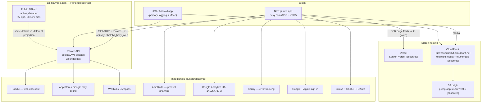
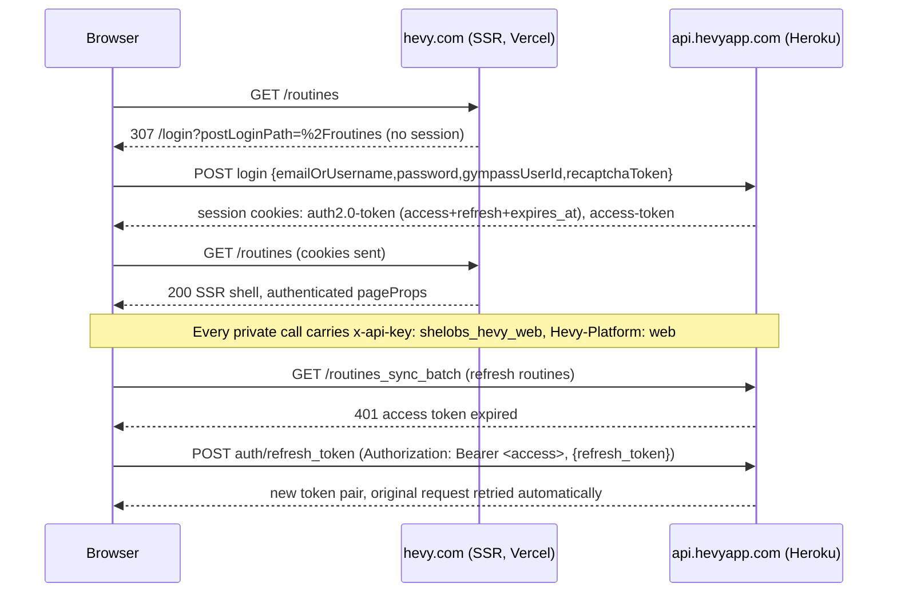
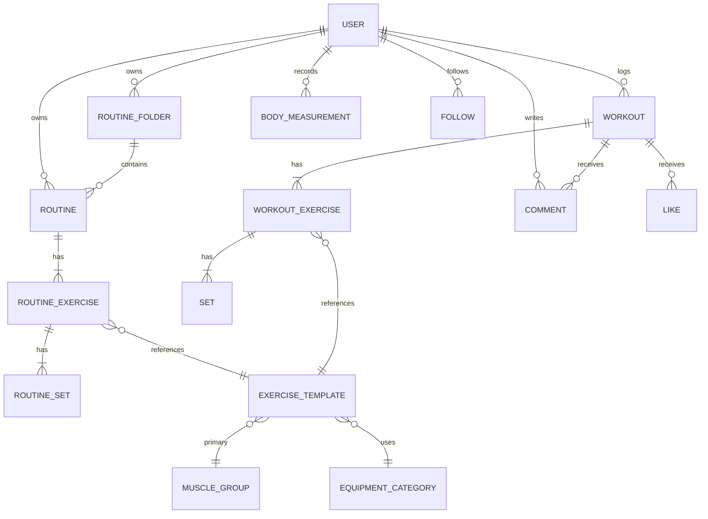

# Hevy (hevy.com) — reverse-engineered architecture

**What this is.** A structural map of Hevy's web product and backend, assembled to design a
comparable fitness app + website. Everything here is derived from artifacts that are publicly
served by Hevy (their JS bundles, their public API spec, their HTTP headers) plus one
authenticated browsing session on a legitimate account. Nothing was obtained by breaching
anything; but see **§9 Legal/ethical** before copying any of it.

**How it was gathered** (so you can judge reliability):

| Source | What it proves | Where it lives |
|---|---|---|
| `_next/static/chunks/pages/_app-*.js` (7.45 MB, public) | API client, auth/token logic, i18n (704 `web.*` keys, 18 locales), bundled exercise catalog | `data/` inputs, quoted in the docs |
| `_buildManifest.js` (public) | All 30 app routes + their chunk graph | `01-routes-and-features.md` |
| OpenAPI 3.0 spec at `api.hevyapp.com/docs` (public) | The *public* v1 API: 22 operations, 28 schemas | `03-api-public.md` |
| Live authenticated session (browser relay) | Real private API calls, cookie auth, full response payloads | `02-api-private.md`, `data/private-api-*.json` |
| HTTP response headers | Hosting, CORS, CDN | `05-stack-and-infrastructure.md` |

Confidence markers used throughout: **[observed]** = seen in a live request/response or HTTP
header; **[bundle]** = literal string in a Hevy JS file; **[spec]** = stated in Hevy's OpenAPI
document; `[INFERENCE]` = my reading of the above, not directly stated.

---

## 1. The single most important structural fact

**Hevy is one domain model with two entirely separate HTTP backends, and its web app is not
where workouts get logged.**

1. **Private backend** — `https://api.hevyapp.com/` (**no** `/v1`), session-cookie auth, consumed
   by the Next.js web app. 95 client call sites → **93 unique method+path pairs**. Returns the rich,
   mobile-shaped payloads (localized titles, unix-second timestamps, `indicator`/`index` fields).
2. **Public backend** — `https://api.hevyapp.com/v1`, `api-key` header (UUID), documented with
   OpenAPI, **Pro accounts only** [spec]. Clean, developer-oriented schemas (snake_case,
   ISO-8601 timestamps, `type` fields). This is the one you integrate against if you were a
   *customer*; it is a projection of the same data.
3. **Web scope** — logging a workout is a *mobile* action. Evidence [bundle]: settings contains
   `web.settings.changeInMobile`; onboarding offers `web.onboarding.onboardingFinish.bestOnMobile`
   and `continueWithWeb`; the feed CTA walks users through `downloadApp` → `logFirstWorkout`; the
   paywall advertises API access as `web.paywallModal.noApiAccess`. The web app is
   **social feed + routine authoring + profile/exercise analytics + account/billing**.

That split is the design decision worth stealing: *author complex data on web, capture it on
mobile, and expose a sanitized public API for third parties.*

---

## 2. System map

---

## 3. Auth model (web)

- Cookie names [observed]: `auth2.0-token` (JSON: `access_token`, `refresh_token`, `expires_at`),
  `access-token`, plus legacy `auth-token` [bundle].
- Client identity header on **every** private call: `x-api-key: shelobs_hevy_web` and
  `Hevy-Platform: web` [bundle]. `x-client-time` (unix seconds) accompanies token refresh [bundle].
- Social + recovery endpoints [bundle]: `login_google_web`, `sign_up_google_web`,
  `recover_password`, `email_download_link`, `update_password_with_password`, `auth/migrate`.
- Third-party OAuth: `/oauth/authorize` consent screen with scopes
  `logWorkout`, `editWorkout`, `readWorkout`, `readRoutine`, `modifyRoutine` [bundle] —
  a ChatGPT integration is named in the copy (`web.oAuthAuthorize.chatGptRequestingPermission`).

---

## 4. Domain model (the join hub is the exercise template)

Two details that matter and are easy to miss:

- **Every exercise row denormalizes `exercise_template_id`** in both routines and workouts
  (not just an FK to a join table) — so history/stats queries are `WHERE exercise_template_id = X`
  over set rows. That is exactly how Hevy's exercise History/Statistics tabs work.
- **Two id spaces per aggregate**: internal UUID (`e95a9921-…`) plus a short share id
  (`ZTNVLuJjSzM`) used in URLs and invite links. The web routes are built on the **short** id
  (`/workout/[workoutId]`, `/routine/[shortId]`).

---

## 5. Feature surface (what exists, at a glance)

| Area | Web capability | Key evidence |
|---|---|---|
| Social feed | Home feed, likes, comments, followers/following lists, user search, recommended athletes, PR badges | `web.feed.*` (12 keys), `web.workoutCell.*` (17), `web.commentModal.*` |
| Routines | CRUD, folders, duplicate, supersets, rest timers, rep ranges, warmup/failure/drop sets, total sets + estimated duration summary | `web.routines.*` (36), `web.createRoutine.*` (43), `web.routineSummary.*` |
| Exercise library | 452 templates, search, muscle/equipment filters, custom exercises, 18 localized titles | catalog in bundle; `web.exerciseLibrary.*` |
| Exercise analytics | Per-exercise How-To / Statistics / History tabs; 1RM, set volume, most reps, best time, pace, steps, floors charts | `web.exercise.charts.*` (11 chart types) |
| Profile | Calendar of workouts, week/year/all-time stats, private-profile gating, public user profiles | `web.profile.*` (21) |
| Programs | Read-only Hevy-authored programs: difficulty/goal/equipment tags, routine counts, save to my routines | `web.programDetail.*` (28) |
| Coaching | Coach ↔ client invites (by username or short id), client onboarding, Pro included | `web.coach.*` (37) |
| Monetization | Plan picker, coupons, free-vs-Pro comparison, FAQ, Paddle/Stripe/App Store/Play/Wellhub; limit-upgrade modals | `web.paywall.*` (43), `web.settings.subscription.*` |
| Settings | Theme, units, language, private profile, password, API keys, webhooks, CSV export, delete account | `web.settings.*` (120) |

---

## 6. What the web app deliberately does *not* do

Useful negative space when scoping your own product:

- **No workout logging on web** (mobile only) — see §1.
- **No social messaging / DMs** anywhere in the key surface.
- **No custom program authoring** on web — only *saving* Hevy programs.
- Legacy/duplicate namespaces show drift to avoid copying: both `web.oAuthAuthorize.*` and
  `web.oauthAuthorize.*` exist [bundle]; two id spaces per aggregate (§4).

---

## 7. Reference docs

| File | Contents |
|---|---|
| `01-routes-and-features.md` | All 30 routes with purpose + evidence, nav structure, modals, settings surface |
| `02-api-private.md` | The app's real backend: base config, auth, 93 endpoints, observed payload shapes |
| `03-api-public.md` | The documented v1 API: 22 operations, 28 schemas, auth, constraints |
| `04-data-model.md` | Entity field tables (public schemas + observed private payloads), enums, relations |
| `05-stack-and-infrastructure.md` | Hosting, CDN, third parties, versions, headers |
| `06-design-guidance.md` | How to turn this into your own schema, features and phasing |
| `data/*.json` | Machine-readable: endpoints, schemas, observed payload shapes |

## 8. Verification status

- Route list, feature keys, endpoint paths, schemas: **verified against the artifacts** named in
  each doc.
- Private endpoint paths: extracted statically *and* corroborated by 25 live calls with `200`
  responses (`data/private-api-full-payloads.json`).
- Live payload shapes: captured from a real account; personal values are not reproduced in these
  docs (only key/type structure).
- **Not verified:** endpoints that a read-only pass never triggers (all write paths except
  `routines_sync_batch`), the mobile app's own API usage, and anything server-side.

## 9. Legal / ethical

- Exercise **videos and thumbnails are Hevy-hosted assets** on their CDN. They are copyrighted
  material; do not ship them in your product. Use them for reference/learning only.
- The exercise catalog *structure* (muscle group / equipment / exercise-type vocabularies) is a
  standard fitness-domain model — reimplementing it is fine; copying their media is not.
- The public v1 API is documented for third-party use but is explicitly Pro-only and
  ["we make no guarantees that we won't completely change the structure or abandon the project"](https://api.hevyapp.com/docs) [spec].
  If you integrate, treat it as unstable.
- The private API is undocumented and unversioned. Building a product on it is fragile and likely
  against ToS; this document describes it for **architectural learning**, not as an integration
  target.
